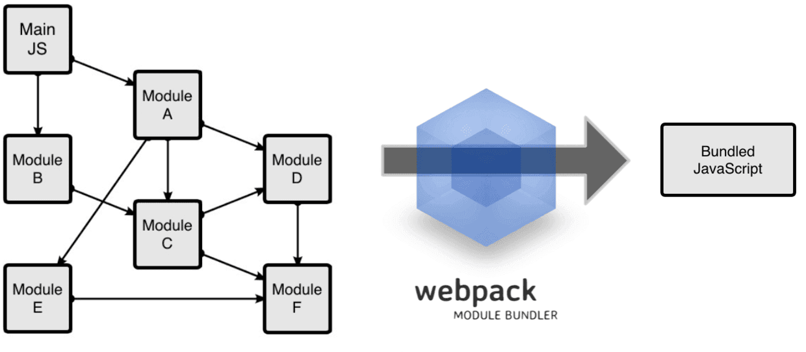

# 学习 webpack 笔记

> ## 什么是 webpack ？  
> webpack 可以看做是模块打包机，分析项目结构，将一些浏览器不能运行的模块，打包为
> 浏览器可以识别的 js 文件。

> ## webpack 的工作原理  
> 通过一个给定的主文件，从这个文件开始找到项目中所有的依赖文件，使用 loaders 处理
> 他们，最后打包为一个或多个浏览器可以识别的 js 
> 

> ## 本文主要引用了：
> 作者：zhangwang 《入门Webpack，看这篇就够了》
> 链接：<http://www.jianshu.com/p/42e11515c10f>
> 來源：简书

## 初步使用
在全局或局部安装 webpack 后，你可以使用下面格式的命令打包你的代码（不加大括号）
```
webpack { entry file } { destination for bundled file }
```
非全局安装时：
```
node_modules/.bin/webpack { entry file } { destination for bundled file }
```
当然你也可以用配置文件来使用 webpack   
在根目录建立名为 webpack.config.js 的配置文件，内容如下：
```
module.exports = {
  entry:  __dirname + "/app/main.js",//已多次提及的唯一入口文件
  output: {
    path: __dirname + "/public",//打包后的文件存放的地方
    filename: "bundle.js"//打包后输出文件的文件名
  }
}
```
之后只要运行 webpack 就行（全局和局部一样）

## 开启热刷新
想开启热刷新首先要开启本地服务器，webpack 提供了本地服务器功能块  
安装相应服务器代码：
```
npm install --save-dev webpack-dev-server
```
配置服务器：
```
devServer: { 
    contentBase: "./public", // 不设置默认根目录服务器，设置则代理对应文件夹
    historyApiFallback: true, // 不跳转页面，所有跳转指向 index.html
    inline: true, // 开启你梦寐以求的实时刷新；
    port: "8080" // 默认监听端口。
}
```
> 但此处实时刷新只监测入口文件以及引用的文件。

## webpack loaders
Loader 是 webpack 最牛的功能之一，通过使用不同的 loaders 加载编译不同类型的文件，  
最终编译为浏览器可用的文件。

Loaders 需要单独安装并在 webpack.config.js 中的 modules 关键字下进行配置，  
包括一下几方面：
```
module: {
    rules: [
        {
            test: /(\.jsx|\.js)$/, // 用以匹配 loaders 所处理的文件， 必须
            use: {
                loader: "babel-loader" // loader 的名称，必须
            },
            exclude: /node_modules/ // 忽略的文件，可选
            // include: '', // 必须处理的文件， 可选
            // query: ''    // 提供额外的设置选项， 可选
        }
    ]
}
```
### bable-loader
几乎大部分人使用 webpack 是为了使用 es6，es7 的新特性，这里特别贴出使用 babel 
的 webpack 安装及配置(配置如上)：
```
npm install --save-dev babel-core babel-loader babel-preset-es2015 
```
### css-loader style-loader
webpack 提供两个工具处理样式表，css-loader 和 style-loader ,
> css-loader 读取 .css 文件，可使用 @import 和 url(...) 实现 require() 功能
> style-loader 将 读取到的 css 添加到 js 中。
首先安装他们两
```
npm install --save-dev style-loader css-loader
```
两兄弟一起上 module 
```
{
    test: /\.css$/,
    use: [
        {
            loader: "style-loader"
        }, {
            loader: "css-loader"
        }
    ]
}
```
## 插件 Plugins
插件是用来拓展 webpack 功能的，在整个构建过程中生效，所以每次添加插件后需要重启服务  
Plugins 和 loaders 是完全不同的东西，Loaders 大多对某种类型的文件生效，
而 Plugins 直接对整个构建过程生效。  
和 Loaders 相似，插件先用 npm 安装后，使用如下代码配置
```
plugins: [
    new webpack.BannerPlugin('版权所有，翻版必究')
],
```
这是一个添加注释的插件。
### 下面介绍一些工作中常用的插件
1. HtmlWebpackPlugin => 依据 html 模板生成自动引用打包后 js 文件的生产用 index.html
在每次生成的js文件名称不同时非常有用（比如添加了 hash 值）  
html 模板
```
// index.tmpl.html
<!DOCTYPE html>
<html lang="en">
  <head>
    <meta charset="utf-8">
    <title>Webpack Sample Project</title>
  </head>
  <body>
    <div id='root'>
    </div>
  </body>
</html>
```
```
plugins: [
    new HtmlWebpackPlugin({
        template: __dirname + "/app/index.tmpl.html"//new 一个这个插件的实例，并传入相关的参数
    })
]
```
再次执行 npm start 时，会自动生成 bundle.js 和 index.html
