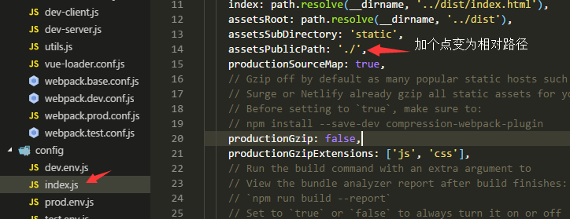
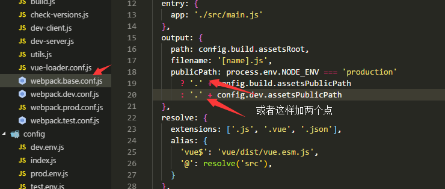
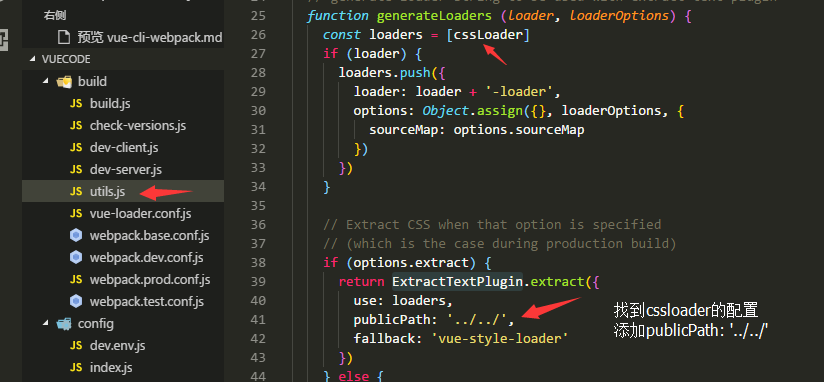
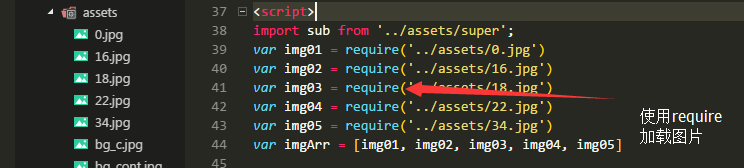

# 这里主要记录使用 vue-cli webpack 模板时遇到的问题及解决办法。

修改打包文件引用为相对路径  
===

vue-cli 使用 webpack 生成的模板（之后以模板代替）运行 `npm run build` 后打包生成的文件只能放在根目录，
如果你想改成相对路径，那你需要进行如下修改：  
  修改 config => index.js => assetsPublicPath: './'
  
你也可以修改 build => webpack.base.config.js => publicPath : './'
  
其实就加个点。。。  

修改 vue-cli css 中引用的图片路径为相对路径  
==
上面只解决文件在 index.html 中引入时的问题，而在实际开发中经常会在 css 中各种引用
图片，比如背景图片啥的，如果你想把它们也变为相对路径，那你需要  
修改 build => utils.js => util.js 里找到ExtractTextPlugin.extract 添加属性 publicPaht: '../../'
  

js 引用的图片处理
==
首先明确一点，webpack 打包时会处理所有入口文件（比如main.js）引用的文件，但都是基于字符串处理的，所以
 js 动态加载的图片不会被处理，为解决这一问题，我这里采用了显式的引用图片来处理，考虑也许会有动态读取 js 文件编译达到各种神奇的效果，我没找到。。。如果找到请一定告诉我  
 